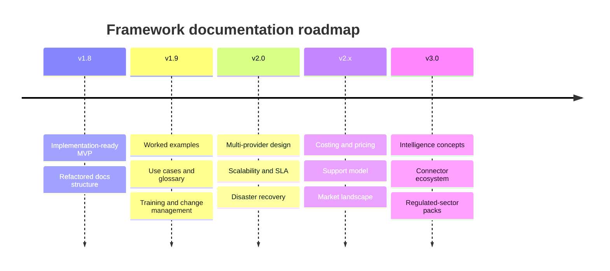

# Roadmap

How the Validated AI Delivery Framework evolves, and how the community shapes it. This roadmap covers the documentation and concept set; delivery sequencing for an implementing team is in [phase-packages/README.md](phase-packages/README.md), and the post-MVP capability stages are in [docs/rollout-operating-model.md](docs/rollout-operating-model.md).

## Release themes

| Version | Theme | Goals |
|---|---|---|
| v1.8 (current) | Implementation-ready MVP | GitHub + Jira, five core metrics, confidence scoring, graduated policy, refactored docs structure |
| v1.9 | Depth and worked examples | Worked confidence/risk examples, deeper governance legal basis, use cases, glossary, training material |
| v2.0 | Multi-provider and scale | GitLab/Azure DevOps/Bitbucket integration design, scalability and SLA targets, disaster recovery, support model |
| v2.x | Operability and adoption | Cost and pricing model, change-management playbooks, market positioning, expanded security guardrails |
| v3.0 | Intelligence and ecosystem | Stage 4 intelligence concepts (trust calibration, dependency risk, quality gap), open connector ecosystem, regulated-sector packs |



## Scope boundaries per version

```text
v1.9 deepens what exists; it does not add new platform surface area.
v2.0 adds provider breadth and operational hardening as design documents, still ahead of any platform build.
v3.0 introduces advanced intelligence only as confidence and evidence allow, never as default enforcement.
```

The non-negotiable rules in [docs/governance-and-privacy.md](docs/governance-and-privacy.md) hold across every version. No release relaxes the no-ranking, no-raw-prompt-storage or confidence-gated-enforcement principles.

## How community proposals are handled

```text
1. Open an Issue describing the problem and the desired outcome.
2. A maintainer triages it: accepted, needs-discussion, or out-of-scope (with reason).
3. Accepted, non-trivial changes become an RFC: a short proposal document in proposal/ branch.
4. The RFC states motivation, proposed change, affected documents, alternatives and risks.
5. A review window (typically two weeks) gathers feedback.
6. The maintainers record a decision (adopt, revise, defer or decline) in the RFC thread.
7. Adopted RFCs are scheduled against a target version in this roadmap.
```

Small fixes (typos, broken links, clarifications) skip the RFC step and go straight to a pull request.

## Out of scope for the foreseeable future

```text
Turning this into a closed commercial-only specification.
Any metric or view that scores or ranks individual developers.
Storing raw prompt content.
Recommending hard enforcement on low-confidence data.
```
