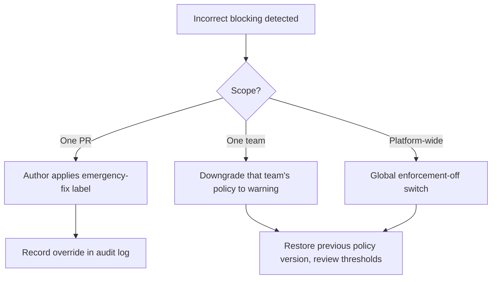

# Disaster Recovery and Business Continuity

How the platform protects data, recovers from failure and safely reverses changes. The platform is operational tooling, not a production dependency of the software it observes, so its failure must never block engineering teams from shipping.

## Guiding rule

```text
If the platform is unavailable or uncertain, it fails open for developers: no PR is blocked because the platform is down.
Enforcement (Phase 4) degrades to warning or off when the backing data or service is unhealthy.
```

## Backup and retention

| Asset | Backup frequency | Retention | Notes |
|---|---|---|---|
| Operational database | Daily full, frequent incremental | Aligned to detailed-data policy (12 months) | Encrypted at rest |
| Raw event store | Continuous (durable stream) plus periodic snapshot | Bounded by privacy retention | Enables replay-based reprocessing |
| Configuration (policies, team config) | On every change, version-controlled | Indefinite (small) | Restorable to any prior version |
| Metric snapshots / aggregates | Daily | 24 months | Cheap to recompute if lost |

```text
Backups inherit the privacy rules: no raw prompt content, identifiers pseudonymised (see governance-and-privacy.md).
Test restores on a schedule; an untested backup is not a backup.
```

## Recovery objectives (planning targets)

| Scenario | Recovery point objective (RPO) | Recovery time objective (RTO) |
|---|---|---|
| Single service crash | 0 (no data loss) | Minutes via automatic restart |
| Database failure | Up to last incremental backup | Hours via restore + replay |
| Full environment loss | Last daily backup | Within one business day |

## Service resilience

```text
Every service exposes a health check; unhealthy instances are restarted automatically.
Collectors write raw events before processing, so a downstream crash never loses an inbound event.
Failed processing retries with backoff and then dead-letters; dead-letter volume is alerted (see testing-and-observability.md).
Reprocessing is replay-based: re-running events is idempotent and does not duplicate records.
```

## Policy rollback (fast reversal of enforcement)

The highest-risk operational event is a policy that blocks merges incorrectly. It must be reversible in minutes.

```text
Every policy change is versioned; the previous version can be restored with one action.
A global "enforcement off" switch downgrades all blocking policies to warning mode immediately, per team or platform-wide.
Per-team downgrade: set the team's enforcement mode back to the previous mode (Enforcement → Warning, or Warning → Observation) via the admin API or UI.
The emergency-fix override (docs/risk-policy-engine.md) remains available at all times as the per-PR escape hatch.
After any rollback, record what triggered it and review thresholds before re-enabling.
```



## Database and migration rollback

```text
Schema migrations are forward-and-backward defined; each migration has a documented reversal.
Migrations are applied in a maintenance step, never silently during normal operation.
A migration that cannot be cleanly reversed must ship with a data-safe fallback and a restore plan.
Migration ownership and the artefacts each change must update are defined in docs/data-model.md.
```

## Continuity for teams during an outage

```text
Developers keep merging normally; checks that depend on the platform report neutral, not failing, when the platform is unreachable.
On recovery, collectors backfill the gap from provider history and reconciliation confirms completeness before metrics are trusted again.
Any metric computed over a known outage window is flagged with a coverage-driven confidence reduction.
```
