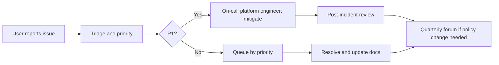

# Support Model and SLA

How users get help, how issues are prioritised and what response they can expect. Tuned for an internal platform tool first, with a path to a tiered model as adoption grows.

## Channels

| Channel | Use for | Audience |
|---|---|---|
| `#ai-delivery-support` (Slack/Teams) | How-to questions, onboarding help | All users |
| `#ai-delivery-feedback` | False positives, noisy alerts, threshold tuning | Developers, tech leads |
| GitHub Issues | Documentation defects, feature proposals, reproducible bugs | Contributors, platform team |
| Private maintainer contact | Conduct reports, security/privacy concerns | Anyone |
| Quarterly governance forum | Policy, ownership and roadmap decisions | Leadership, platform team |

## Priority levels and response targets

| Priority | Definition | First response | Resolution aim |
|---|---|---|---|
| P1 Critical | Incorrect blocking of merges, data loss, privacy breach | Within 1 hour (business) | Mitigate same day (often via enforcement-off or rollback) |
| P2 High | Metric clearly wrong, connector down, dashboard unavailable | Within 1 business day | Within a few business days |
| P3 Medium | Confusing UI, minor inaccuracy, doc gap | Within 3 business days | Next maintenance cycle |
| P4 Low | Enhancement request, cosmetic issue | Acknowledged within a week | Scheduled via roadmap |

```text
Any P1 that involves enforcement uses the fast reversal paths in docs/disaster-recovery.md first, then root-cause analysis.
Privacy or conduct reports are always treated as at least P2 and routed to the data steward or maintainers privately.
```

## Community versus paid support

| Tier | Who | What is included |
|---|---|---|
| Community | Open-source users | GitHub Issues, documentation, best-effort response, no time guarantee |
| Internal platform | Adopting organisation's platform team | Channels above with the response targets in this document |
| Enterprise (future) | Paying organisations | Named contacts, formal SLA, onboarding assistance, priority fixes |

The enterprise tier is a future option tied to the costing model (see costing-pricing.md); it is not part of the MVP.

## Escalation path



## Documentation maintenance commitment

```text
Documentation is reviewed every release and whenever a related fix ships.
Broken links and factual errors are P3 and fixed in the next maintenance cycle.
A change that affects a documented behaviour must update the relevant docs/ file in the same change (see CONTRIBUTING.md).
The TODO.md backlog tracks known documentation gaps openly.
```
