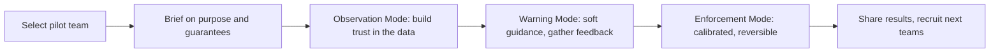

# Training and Change Management

How to introduce the platform to an organisation so it is trusted and used, not feared or ignored. Adoption is a culture problem first and a tooling problem second.

## Training modules by role

| Module | Audience | Duration | Content |
|---|---|---|---|
| Operate the control plane | Platform / DevEx engineers | Half day | Integrations, data confidence, policy configuration, observability, rollback |
| Read the signals | Engineering managers and tech leads | 90 minutes | Team dashboards, review debt, the Validated Delivery Trend, recommendations, what NOT to do (no individual use) |
| Developer essentials | Developers | 30 minutes | The PR template, in-PR guidance, emergency override, "this is not about scoring you" |
| Govern and invest | Executives | 45 minutes | Executive summary, ROI with confidence, rollout pace decisions |
| Oversee risk | Security and compliance | 60 minutes | Sensitive-path policies, prompt-leakage scanning, retention, incident linkage |

```text
Each module ends with the same core message: team-level learning, never individual scoring.
Developer training is deliberately the shortest; the platform must feel light to developers.
```

## Change-management sequence



```text
Pick a pilot of 4-6 engineers doing real but non-critical work (see Phase 0).
Set explicit success criteria up front (see acceptance criteria in PRD.md).
Collect feedback every sprint; treat false positives and alert fatigue as defects, not noise.
Never skip Observation Mode for a new team, even after the pilot succeeds.
```

## Success criteria for adoption

```text
The pilot team trusts the read-only dashboard before any warnings appear.
Psychological safety stays above 3.5 throughout (docs/psychological-safety.md).
At least one concrete improvement is made from a recommendation.
No team requests individual data; if a manager does, the misuse escalation runs.
```

## Feedback instruments

```text
Sprint pulse: the six psychological-safety questions, compared to baseline.
False-positive channel: a dedicated feedback space for bad recommendations and noisy alerts.
Onboarding survey: did the team understand the purpose and the guarantees?
Quarterly forum input: trends and policy adjustments (docs/rollout-operating-model.md).
```

## Common concerns and honest answers

| Concern | Response |
|---|---|
| "Will this platform slow us down?" | Developer touch is light and in-PR only; enforcement starts late, is calibrated and is reversible. |
| "Is this watching me?" | No individual view exists, by design and by policy. Reporting is team-level. |
| "Will managers use this against me in reviews?" | Prohibited; misuse triggers escalation and removal of access (governance-and-privacy.md). |
| "The bot flagged something wrong." | Recommendations are guidance; report it and thresholds are tuned. |
| "We barely use AI; will we look bad?" | Adoption bands are descriptive, never a ranking; low adoption can be the rational choice. |
